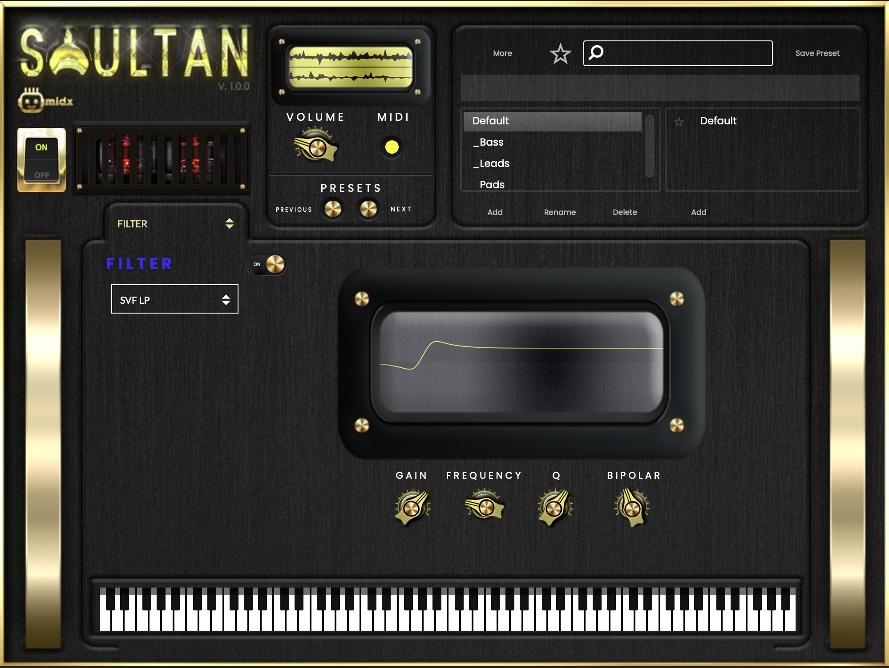
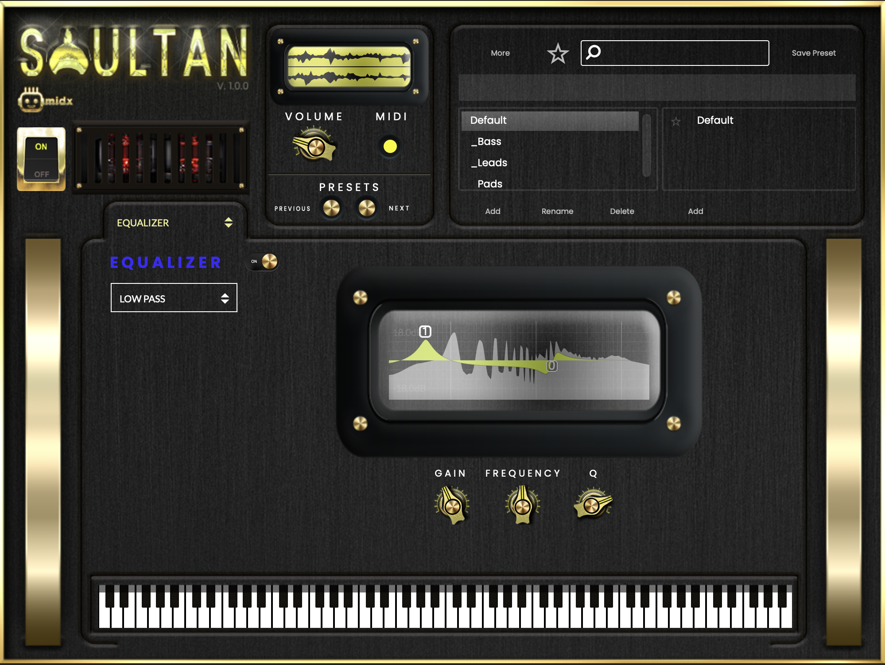
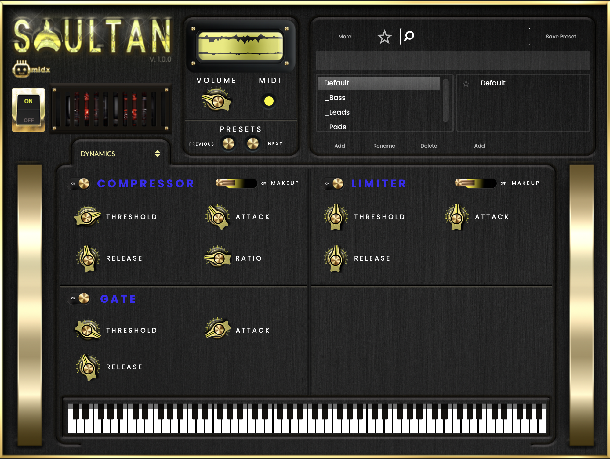
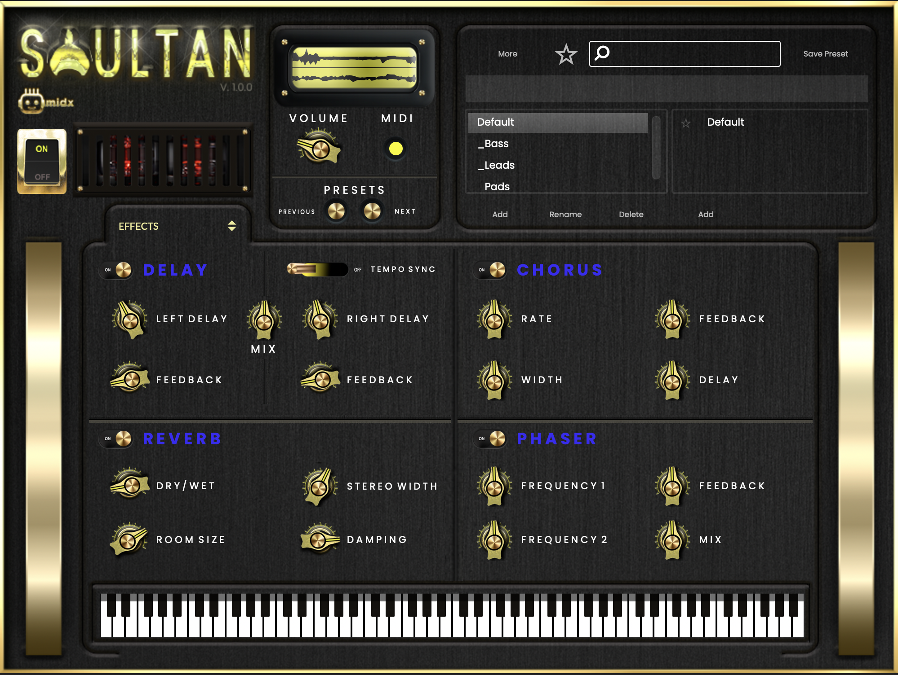

# Soultan Synth


Soultan is a lightweight, expressive, and processor-friendly software synthesizer built using the HISE framework. It is designed for producers, sound designers, and musicians who want a clean workflow, intuitive controls, and a polished analog-inspired sound. Soultan combines dual oscillators, flexible modulation, detailed EQ, dynamics shaping, and a full effects suite—resulting in a compact but powerful virtual instrument.

---

## Features

### 🎛 Sound Generation
- Two fully independent oscillators for rich sound design
- Multiple waveform options (customizable via the [HISE engine](https://hise.dev/))
- Oscillator blending and layering for deeper timbral control

### 🎚 Envelope & Modulation
- Classic ADSR envelope (Attack, Decay, Sustain, Release)
- Fine-tuned amplitude shaping for expressive performance

### 🎚 Filter Section
- Versatile filter module for tone sculpting
- Adjustable cutoff and resonance

### 🎚 Equalizer
- Full 4-band EQ
- Independent Q controls for precise shaping

### 🎚 Dynamics Processing
- Built-in compressor for punch and balance
- Limiter for peak control and anti-clipping
- Noise gate to maintain a clean signal path

### 🎧 Effects Suite
- Reverb for ambience and spatial depth
- Delay with adjustable timing and feedback
- Chorus for stereo widening
- Phaser for added movement and texture

### ⚙ General Features
- Powered by the [HISE framework](https://hise.dev/) for efficiency
- Intuitive UI suitable for beginners and advanced sound designers
- Lightweight and optimized for real-time performance

---

## Screenshots

  
  
  
  
  


---

## Requirements
- macOS
- Apple Silicon or Intel CPU
- DAW or host supporting AU (Apple AudioUnit format)
- Sufficient CPU for real-time synthesis (Soultan is lightweight, but high-polyphony patches may vary)

---

## Sound Demo

- [Listen to Soultan Synth Demo 1](../audio/Soultan_Demo_Hard_Trance.mp3)
- [Listen to Soultan Synth Demo 2](../audio/Soultan_Demo_hip-hop.mp3)
- [Listen to Soultan Synth Demo 3](../audio/Soultan_Demo_Italo_Disco.mp3)
- [Listen to Soultan Synth Demo 4](../audio/Soultan_Demo_Mellow_House.mp3)

---

- Axel F. Theme by Harold Faltermeyer:
- [](https://www.youtube.com/watch?v=cK95R3FBADE)
- Another One Bites the Dust by Queen:
- [](https://www.youtube.com/watch?v=u_b9sZQVU1g)
- Family Affair by Mary J. Blige:
- [](https://www.youtube.com/watch?v=0VyFMfIOivE)
- Fascinated by Company B:
- [](https://www.youtube.com/watch?v=Q0XBSBMtKxU)
- Az Naaz by Ahmad Zahir:
- [](https://www.youtube.com/watch?v=K_YWLuEMqvY)
- Jam On It by Newcleus:
- [](https://www.youtube.com/watch?v=iNBkPXya354)

---

## Credits and Acknowledgments
- Developer / Interface / Sound Design: [Hamid Ahang](https://www.midxm.com/about-hamid-ahang)
- Contributing Developer: [Ryan Sahar](https://www.midxm.com/about-ryan-sahar)
- Development Platform: [HISE](https://hise.dev/) | [JUCE Framework](https://juce.com/)
- Special thanks to [Christoph Hart](https://github.com/christophhart/HISE) & [David Healey](https://github.com/davidhealey)

---

## Licensing
- Soultan Synth is released under the [GPL v3 License](../LICENSE).

---

## Installation

```bash
# Clone the repository
git clone https://github.com/hamidahang/soultan.git
cd soultan

# Open the HISE client and navigate to "Soultan.xml" to build/run

---

## Contact & Website
- Official website: [https://midxm.com](https://midxm.com)
- Support email: [info@midxm.com](mailto:info@midxm.com)
